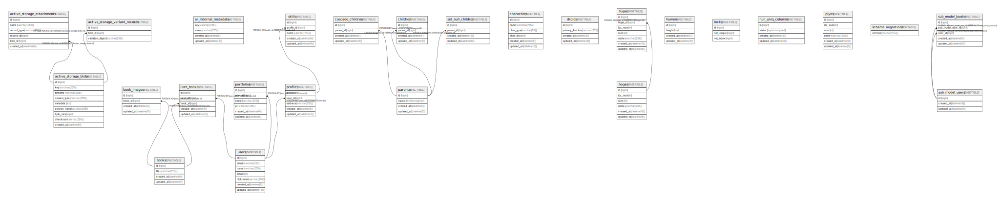

# app_development

## Tables

| Name | Columns | Comment | Type |
| ---- | ------- | ------- | ---- |
| [active_storage_attachments](active_storage_attachments.md) | 6 |  | BASE TABLE |
| [active_storage_blobs](active_storage_blobs.md) | 9 |  | BASE TABLE |
| [active_storage_variant_records](active_storage_variant_records.md) | 3 |  | BASE TABLE |
| [ar_internal_metadata](ar_internal_metadata.md) | 4 |  | BASE TABLE |
| [book_images](book_images.md) | 4 |  | BASE TABLE |
| [books](books.md) | 4 |  | BASE TABLE |
| [children](children.md) | 4 |  | BASE TABLE |
| [fugas](fugas.md) | 7 |  | BASE TABLE |
| [hoges](hoges.md) | 6 |  | BASE TABLE |
| [locks](locks.md) | 3 |  | BASE TABLE |
| [parents](parents.md) | 4 |  | BASE TABLE |
| [piyos](piyos.md) | 6 |  | BASE TABLE |
| [portfolios](portfolios.md) | 6 |  | BASE TABLE |
| [profiles](profiles.md) | 5 |  | BASE TABLE |
| [schema_migrations](schema_migrations.md) | 1 |  | BASE TABLE |
| [skills](skills.md) | 5 |  | BASE TABLE |
| [user_books](user_books.md) | 5 |  | BASE TABLE |
| [users](users.md) | 6 |  | BASE TABLE |

## Relations

---

> Generated by [tbls](https://github.com/k1LoW/tbls)
