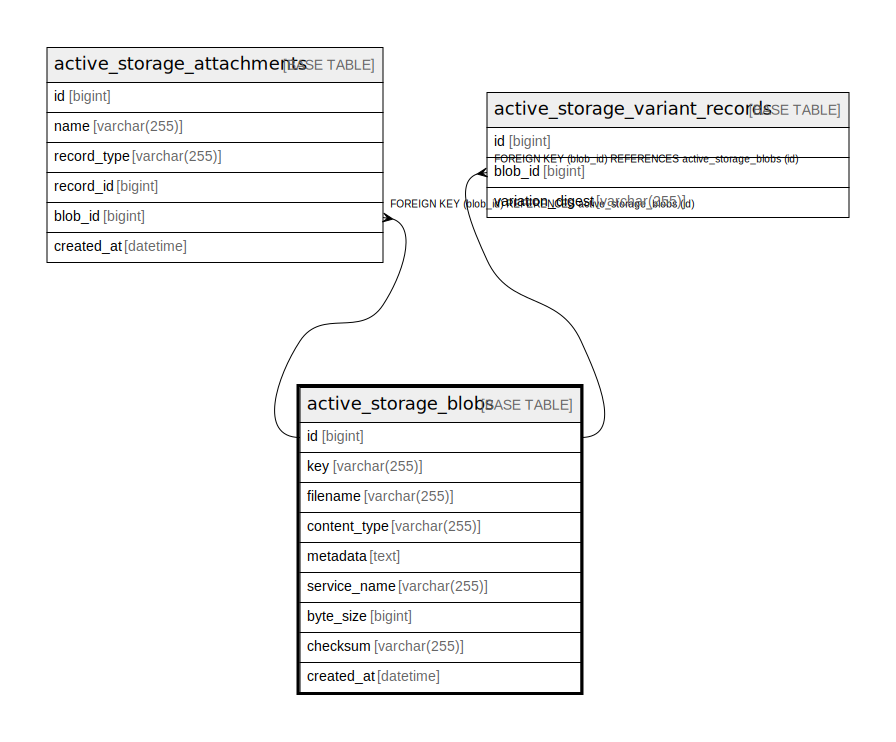

# active_storage_blobs

## Description

<details>
<summary><strong>Table Definition</strong></summary>

```sql
CREATE TABLE `active_storage_blobs` (
  `id` bigint NOT NULL AUTO_INCREMENT,
  `key` varchar(255) COLLATE utf8mb4_general_ci NOT NULL,
  `filename` varchar(255) COLLATE utf8mb4_general_ci NOT NULL,
  `content_type` varchar(255) COLLATE utf8mb4_general_ci DEFAULT NULL,
  `metadata` text COLLATE utf8mb4_general_ci,
  `service_name` varchar(255) COLLATE utf8mb4_general_ci NOT NULL,
  `byte_size` bigint NOT NULL,
  `checksum` varchar(255) COLLATE utf8mb4_general_ci NOT NULL,
  `created_at` datetime(6) NOT NULL,
  PRIMARY KEY (`id`),
  UNIQUE KEY `index_active_storage_blobs_on_key` (`key`)
) ENGINE=InnoDB DEFAULT CHARSET=utf8mb4 COLLATE=utf8mb4_general_ci
```

</details>

## Columns

| Name | Type | Default | Nullable | Extra Definition | Children | Parents | Comment |
| ---- | ---- | ------- | -------- | ---------------- | -------- | ------- | ------- |
| id | bigint |  | false | auto_increment | [active_storage_attachments](active_storage_attachments.md) [active_storage_variant_records](active_storage_variant_records.md) |  |  |
| key | varchar(255) |  | false |  |  |  |  |
| filename | varchar(255) |  | false |  |  |  |  |
| content_type | varchar(255) |  | true |  |  |  |  |
| metadata | text |  | true |  |  |  |  |
| service_name | varchar(255) |  | false |  |  |  |  |
| byte_size | bigint |  | false |  |  |  |  |
| checksum | varchar(255) |  | false |  |  |  |  |
| created_at | datetime(6) |  | false |  |  |  |  |

## Constraints

| Name | Type | Definition |
| ---- | ---- | ---------- |
| index_active_storage_blobs_on_key | UNIQUE | UNIQUE KEY index_active_storage_blobs_on_key (key) |
| PRIMARY | PRIMARY KEY | PRIMARY KEY (id) |

## Indexes

| Name | Definition |
| ---- | ---------- |
| PRIMARY | PRIMARY KEY (id) USING BTREE |
| index_active_storage_blobs_on_key | UNIQUE KEY index_active_storage_blobs_on_key (key) USING BTREE |

## Relations



---

> Generated by [tbls](https://github.com/k1LoW/tbls)
