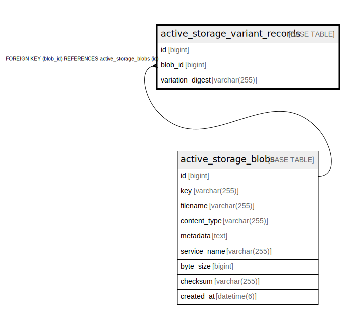

# active_storage_variant_records

## Description

<details>
<summary><strong>Table Definition</strong></summary>

```sql
CREATE TABLE `active_storage_variant_records` (
  `id` bigint NOT NULL AUTO_INCREMENT,
  `blob_id` bigint NOT NULL,
  `variation_digest` varchar(255) COLLATE utf8mb4_general_ci NOT NULL,
  PRIMARY KEY (`id`),
  UNIQUE KEY `index_active_storage_variant_records_uniqueness` (`blob_id`,`variation_digest`),
  CONSTRAINT `fk_rails_993965df05` FOREIGN KEY (`blob_id`) REFERENCES `active_storage_blobs` (`id`)
) ENGINE=InnoDB DEFAULT CHARSET=utf8mb4 COLLATE=utf8mb4_general_ci
```

</details>

## Columns

| Name | Type | Default | Nullable | Extra Definition | Children | Parents | Comment |
| ---- | ---- | ------- | -------- | ---------------- | -------- | ------- | ------- |
| id | bigint |  | false | auto_increment |  |  |  |
| blob_id | bigint |  | false |  |  | [active_storage_blobs](active_storage_blobs.md) |  |
| variation_digest | varchar(255) |  | false |  |  |  |  |

## Constraints

| Name | Type | Definition |
| ---- | ---- | ---------- |
| fk_rails_993965df05 | FOREIGN KEY | FOREIGN KEY (blob_id) REFERENCES active_storage_blobs (id) |
| index_active_storage_variant_records_uniqueness | UNIQUE | UNIQUE KEY index_active_storage_variant_records_uniqueness (blob_id, variation_digest) |
| PRIMARY | PRIMARY KEY | PRIMARY KEY (id) |

## Indexes

| Name | Definition |
| ---- | ---------- |
| PRIMARY | PRIMARY KEY (id) USING BTREE |
| index_active_storage_variant_records_uniqueness | UNIQUE KEY index_active_storage_variant_records_uniqueness (blob_id, variation_digest) USING BTREE |

## Relations



---

> Generated by [tbls](https://github.com/k1LoW/tbls)
