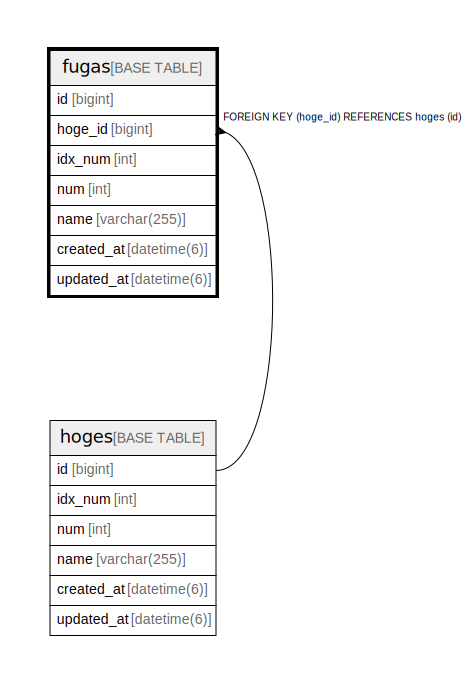

# fugas

## Description

<details>
<summary><strong>Table Definition</strong></summary>

```sql
CREATE TABLE `fugas` (
  `id` bigint NOT NULL AUTO_INCREMENT,
  `hoge_id` bigint NOT NULL,
  `idx_num` int NOT NULL DEFAULT '0',
  `num` int NOT NULL DEFAULT '0',
  `name` varchar(255) COLLATE utf8mb4_general_ci DEFAULT NULL,
  `created_at` datetime(6) NOT NULL,
  `updated_at` datetime(6) NOT NULL,
  PRIMARY KEY (`id`),
  KEY `hoge_id` (`hoge_id`),
  KEY `idx_num` (`idx_num`),
  CONSTRAINT `hoge_id_on_fugas` FOREIGN KEY (`hoge_id`) REFERENCES `hoges` (`id`) ON DELETE CASCADE
) ENGINE=InnoDB DEFAULT CHARSET=utf8mb4 COLLATE=utf8mb4_general_ci
```

</details>

## Columns

| Name | Type | Default | Nullable | Extra Definition | Children | Parents | Comment |
| ---- | ---- | ------- | -------- | ---------------- | -------- | ------- | ------- |
| id | bigint |  | false | auto_increment |  |  |  |
| hoge_id | bigint |  | false |  |  | [hoges](hoges.md) |  |
| idx_num | int | 0 | false |  |  |  |  |
| num | int | 0 | false |  |  |  |  |
| name | varchar(255) |  | true |  |  |  |  |
| created_at | datetime(6) |  | false |  |  |  |  |
| updated_at | datetime(6) |  | false |  |  |  |  |

## Constraints

| Name | Type | Definition |
| ---- | ---- | ---------- |
| hoge_id_on_fugas | FOREIGN KEY | FOREIGN KEY (hoge_id) REFERENCES hoges (id) |
| PRIMARY | PRIMARY KEY | PRIMARY KEY (id) |

## Indexes

| Name | Definition |
| ---- | ---------- |
| hoge_id | KEY hoge_id (hoge_id) USING BTREE |
| idx_num | KEY idx_num (idx_num) USING BTREE |
| PRIMARY | PRIMARY KEY (id) USING BTREE |

## Relations



---

> Generated by [tbls](https://github.com/k1LoW/tbls)
