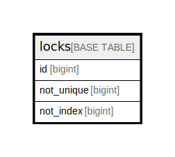

# locks

## Description

<details>
<summary><strong>Table Definition</strong></summary>

```sql
CREATE TABLE `locks` (
  `id` bigint NOT NULL AUTO_INCREMENT,
  `not_unique` bigint NOT NULL,
  `not_index` bigint NOT NULL,
  PRIMARY KEY (`id`),
  KEY `not_unique` (`not_unique`)
) ENGINE=InnoDB DEFAULT CHARSET=utf8mb4 COLLATE=utf8mb4_general_ci
```

</details>

## Columns

| Name | Type | Default | Nullable | Extra Definition | Children | Parents | Comment |
| ---- | ---- | ------- | -------- | --------------- | -------- | ------- | ------- |
| id | bigint |  | false | auto_increment |  |  |  |
| not_unique | bigint |  | false |  |  |  |  |
| not_index | bigint |  | false |  |  |  |  |

## Constraints

| Name | Type | Definition |
| ---- | ---- | ---------- |
| PRIMARY | PRIMARY KEY | PRIMARY KEY (id) |

## Indexes

| Name | Definition |
| ---- | ---------- |
| not_unique | KEY not_unique (not_unique) USING BTREE |
| PRIMARY | PRIMARY KEY (id) USING BTREE |

## Relations



---

> Generated by [tbls](https://github.com/k1LoW/tbls)
