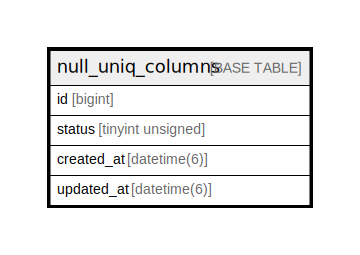

# null_uniq_columns

## Description

<details>
<summary><strong>Table Definition</strong></summary>

```sql
CREATE TABLE `null_uniq_columns` (
  `id` bigint NOT NULL AUTO_INCREMENT,
  `status` tinyint unsigned DEFAULT NULL,
  `created_at` datetime(6) NOT NULL,
  `updated_at` datetime(6) NOT NULL,
  PRIMARY KEY (`id`),
  UNIQUE KEY `status` (`status`)
) ENGINE=InnoDB AUTO_INCREMENT=[Redacted by tbls] DEFAULT CHARSET=utf8mb4 COLLATE=utf8mb4_general_ci
```

</details>

## Columns

| Name | Type | Default | Nullable | Extra Definition | Children | Parents | Comment |
| ---- | ---- | ------- | -------- | ---------------- | -------- | ------- | ------- |
| id | bigint |  | false | auto_increment |  |  |  |
| status | tinyint unsigned |  | true |  |  |  |  |
| created_at | datetime(6) |  | false |  |  |  |  |
| updated_at | datetime(6) |  | false |  |  |  |  |

## Constraints

| Name | Type | Definition |
| ---- | ---- | ---------- |
| PRIMARY | PRIMARY KEY | PRIMARY KEY (id) |
| status | UNIQUE | UNIQUE KEY status (status) |

## Indexes

| Name | Definition |
| ---- | ---------- |
| PRIMARY | PRIMARY KEY (id) USING BTREE |
| status | UNIQUE KEY status (status) USING BTREE |

## Relations



---

> Generated by [tbls](https://github.com/k1LoW/tbls)
