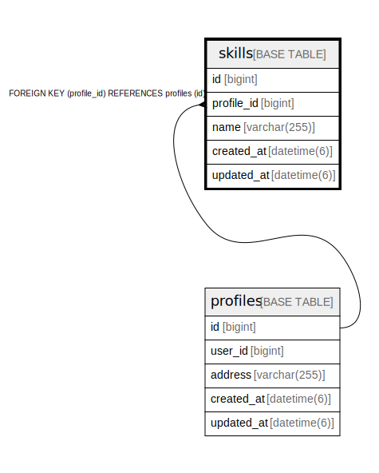

# skills

## Description

<details>
<summary><strong>Table Definition</strong></summary>

```sql
CREATE TABLE `skills` (
  `id` bigint NOT NULL AUTO_INCREMENT,
  `profile_id` bigint NOT NULL,
  `name` varchar(255) COLLATE utf8mb4_general_ci NOT NULL,
  `created_at` datetime(6) NOT NULL,
  `updated_at` datetime(6) NOT NULL,
  PRIMARY KEY (`id`),
  KEY `profile_id` (`profile_id`),
  CONSTRAINT `profile_id_on_skills` FOREIGN KEY (`profile_id`) REFERENCES `profiles` (`id`) ON DELETE CASCADE
) ENGINE=InnoDB DEFAULT CHARSET=utf8mb4 COLLATE=utf8mb4_general_ci
```

</details>

## Columns

| Name | Type | Default | Nullable | Extra Definition | Children | Parents | Comment |
| ---- | ---- | ------- | -------- | --------------- | -------- | ------- | ------- |
| id | bigint |  | false | auto_increment |  |  |  |
| profile_id | bigint |  | false |  |  | [profiles](profiles.md) |  |
| name | varchar(255) |  | false |  |  |  |  |
| created_at | datetime(6) |  | false |  |  |  |  |
| updated_at | datetime(6) |  | false |  |  |  |  |

## Constraints

| Name | Type | Definition |
| ---- | ---- | ---------- |
| PRIMARY | PRIMARY KEY | PRIMARY KEY (id) |
| profile_id_on_skills | FOREIGN KEY | FOREIGN KEY (profile_id) REFERENCES profiles (id) |

## Indexes

| Name | Definition |
| ---- | ---------- |
| profile_id | KEY profile_id (profile_id) USING BTREE |
| PRIMARY | PRIMARY KEY (id) USING BTREE |

## Relations



---

> Generated by [tbls](https://github.com/k1LoW/tbls)
